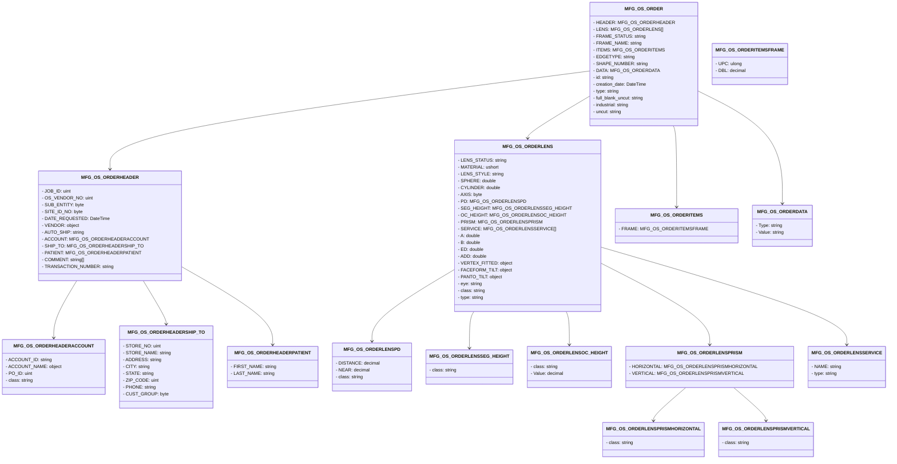

# EvernoteKt

```mermaid
classDiagram
  class MFG_OS_ORDER {
    - HEADER: MFG_OS_ORDERHEADER
    - LENS: MFG_OS_ORDERLENS[]
    - FRAME_STATUS: string
    - FRAME_NAME: string
    - ITEMS: MFG_OS_ORDERITEMS
    - EDGETYPE: string
    - SHAPE_NUMBER: string
    - DATA: MFG_OS_ORDERDATA
    - id: string
    - creation_date: DateTime
    - type: string
    - full_blank_uncut: string
    - industrial: string
    - uncut: string
  }

  class MFG_OS_ORDERHEADER {
    - JOB_ID: uint
    - OS_VENDOR_NO: uint
    - SUB_ENTITY: byte
    - SITE_ID_NO: byte
    - DATE_REQUESTED: DateTime
    - VENDOR: object
    - AUTO_SHIP: string
    - ACCOUNT: MFG_OS_ORDERHEADERACCOUNT
    - SHIP_TO: MFG_OS_ORDERHEADERSHIP_TO
    - PATIENT: MFG_OS_ORDERHEADERPATIENT
    - COMMENT: string[]
    - TRANSACTION_NUMBER: string
  }

  class MFG_OS_ORDERHEADERACCOUNT {
    - ACCOUNT_ID: string
    - ACCOUNT_NAME: object
    - PO_ID: uint
    - class: string
  }

  class MFG_OS_ORDERHEADERSHIP_TO {
    - STORE_NO: uint
    - STORE_NAME: string
    - ADDRESS: string
    - CITY: string
    - STATE: string
    - ZIP_CODE: uint
    - PHONE: string
    - CUST_GROUP: byte
  }

  class MFG_OS_ORDERHEADERPATIENT {
    - FIRST_NAME: string
    - LAST_NAME: string
  }

  class MFG_OS_ORDERLENS {
    - LENS_STATUS: string
    - MATERIAL: ushort
    - LENS_STYLE: string
    - SPHERE: double
    - CYLINDER: double
    - AXIS: byte
    - PD: MFG_OS_ORDERLENSPD
    - SEG_HEIGHT: MFG_OS_ORDERLENSSEG_HEIGHT
    - OC_HEIGHT: MFG_OS_ORDERLENSOC_HEIGHT
    - PRISM: MFG_OS_ORDERLENSPRISM
    - SERVICE: MFG_OS_ORDERLENSSERVICE[]
    - A: double
    - B: double
    - ED: double
    - ADD: double
    - VERTEX_FITTED: object
    - FACEFORM_TILT: object
    - PANTO_TILT: object
    - eye: string
    - class: string
    - type: string
  }

  class MFG_OS_ORDERLENSPD {
    - DISTANCE: decimal
    - NEAR: decimal
    - class: string
  }

  class MFG_OS_ORDERLENSSEG_HEIGHT {
    - class: string
  }

  class MFG_OS_ORDERLENSOC_HEIGHT {
    - class: string
    - Value: decimal
  }

  class MFG_OS_ORDERLENSPRISM {
    - HORIZONTAL: MFG_OS_ORDERLENSPRISMHORIZONTAL
    - VERTICAL: MFG_OS_ORDERLENSPRISMVERTICAL
  }

  class MFG_OS_ORDERLENSPRISMHORIZONTAL {
    - class: string
  }

  class MFG_OS_ORDERLENSPRISMVERTICAL {
    - class: string
  }

  class MFG_OS_ORDERLENSSERVICE {
    - NAME: string
    - type: string
  }

  class MFG_OS_ORDERITEMS {
    - FRAME: MFG_OS_ORDERITEMSFRAME
  }

  class MFG_OS_ORDERITEMSFRAME {
    - UPC: ulong
    - DBL: decimal
  }

  class MFG_OS_ORDERDATA {
    - Type: string
    - Value: string
  }
MFG_OS_ORDER --> MFG_OS_ORDERHEADER
MFG_OS_ORDER --> MFG_OS_ORDERLENS 
MFG_OS_ORDER --> MFG_OS_ORDERITEMS
MFG_OS_ORDER --> MFG_OS_ORDERDATA
MFG_OS_ORDERHEADER --> MFG_OS_ORDERHEADERACCOUNT
MFG_OS_ORDERHEADER --> MFG_OS_ORDERHEADERSHIP_TO
MFG_OS_ORDERHEADER --> MFG_OS_ORDERHEADERPATIENT 
MFG_OS_ORDERLENS --> MFG_OS_ORDERLENSPD
MFG_OS_ORDERLENS --> MFG_OS_ORDERLENSPRISM
MFG_OS_ORDERLENS --> MFG_OS_ORDERLENSSERVICE
MFG_OS_ORDERLENSPRISM --> MFG_OS_ORDERLENSPRISMHORIZONTAL
MFG_OS_ORDERLENSPRISM --> MFG_OS_ORDERLENSPRISMVERTICAL
MFG_OS_ORDERLENS --> MFG_OS_ORDERLENSOC_HEIGHT
MFG_OS_ORDERLENS --> MFG_OS_ORDERLENSSEG_HEIGHT
```
